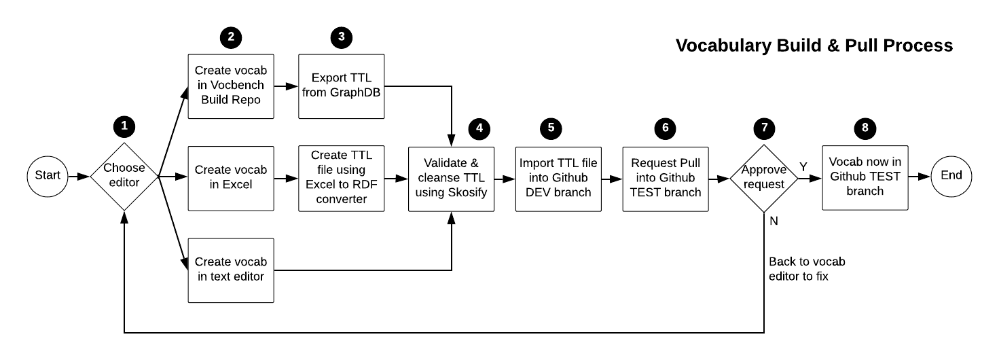

# GSQ Vocabularies
## Introduction
The Geological Survey of Queensland (GSQ) publishes vocabularies - a way to describe things and the relationship between things.

A vocabulary is a set of agreed terms:
* In GSQ, a vocabulary defines the terms used to describe and represent things in the domain of science and data management.
* Vocabularies align information within a business area or across systems.
* Vocabularies can be very complex (with thousands of terms) or very simple (describing one or two concepts only).

## How to create a vocabulary
  
**Fig. 1**: Vocabulary build and test process 

1. Select the vocabulary editor of your choice. (We will work with GA on researching and selecting the best editor going forward).
2. Create the vocabulary using the [SKOS Simple Knowledge Organization System](https://www.w3.org/TR/skos-reference/). See also the [SKOS Primer] for the basics(https://www.w3.org/TR/skos-primer/). NOTE: Always first check if there is an international or national vocabulary (see below for links).
3. Export the 
4.
5. 
6. 
7. 
8. 
9. 
10. 
11.
12. 
13. 

These are the source files for GSQ's vocabularies. The vocabularies appear online at their namespace locations which are given in their data, for example the vocab "Geophysical Surveys" has the following content:

```
...
<http://linked.data.gov.au/def/geophysical-survey> a owl:Ontology .

:conceptScheme a skos:ConceptScheme;
  dct:created "2019-02-06T10:44:40.696+10:00"^^xsd:dateTime;
  skos:prefLabel "GSQ Geophysical Surveys Keywords"@en .

:Data_Processing a skos:Concept;
  dct:created "2019-02-06T10:44:57.750+10:00"^^xsd:dateTime;
  skos:inScheme :conceptScheme;
  skos:prefLabel "Data Processing"@en;
skos:topConceptOf :conceptScheme .
...
```
... and it appears online at <http://linked.data.gov.au/def/geophysical-survey>.

Additionally, all GSQ vocabs and non-GSQ vocabs used by GSQ, are listed at <http://vocabs.gsq.digital>.


## Files
* **ontologies/\*.ttl** - background ontologies needed for vocab inferencing
* **gsq-\*.ttl** - GSQ vocab files
* **vocabs_load.py** - a Python script to load a GraphDB instance with the background ontologies and GSQ vocab files
* **scripts/** - Python scripts to dump/load a GrpahDB instance with these vocab files


## License
This code repository's content are licensed under the [Creative Commons Attribution 4.0 International (CC BY 4.0)](https://creativecommons.org/licenses/by/4.0/), the deed of which is stored in this repository here: [LICENSE](LICENSE).


## Contacts
*Vocabularies owner*:  
**Mark Gordon**  
Geological Survey of Quensland  
Department of Natural Resources, Mines and Energy  
Brisbane, QLD, Australia  
<mark.gordon@dnrme.qld.gov.au>  

*Technical contact*:  
**Nicholas Car**  
*Senior Experimental Scientist*  
CSIRO Land & Water, Brisbane, Australia  
<nicholas.car@csiro.au>  
<http://orcid.org/0000-0002-8742-7730>  

*Vocabulary collectors*:  
**Sophie Darnell** (CSIRO Land & Water)  
**David Crosswell** (GSQ)  
*...other GSQ staff...*  
