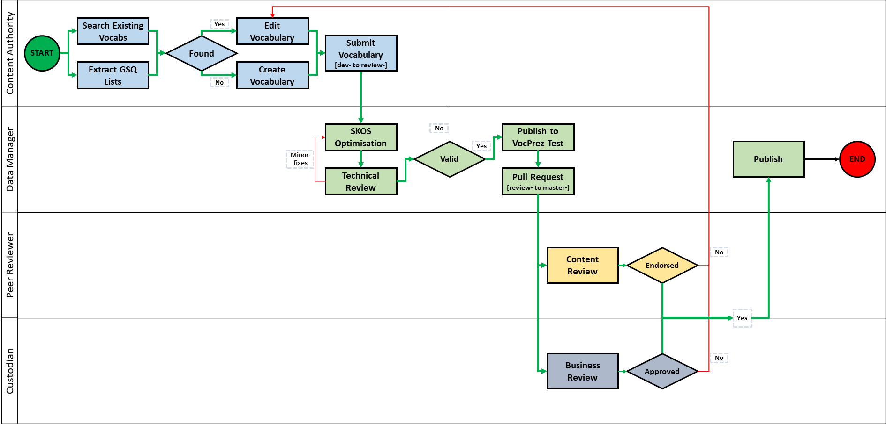

# GSQ Vocabularies
## Introduction
The Geological Survey of Queensland (GSQ) publishes vocabularies - a way to describe things and the relationship between things.

A vocabulary is a set of agreed terms:
* In GSQ, a vocabulary defines the terms used to describe and represent things in the domain of science and data management.
* Vocabularies align information within a business area or across systems.
* Vocabularies can be very complex (with thousands of terms) or very simple (describing one or two concepts only).

Read [Why Vocabularies?](https://github.com/geological-survey-of-queensland/vocabularies/wiki/Why-Vocabularies%3F) and more subjects in the [Vocabularies Wiki](https://github.com/geological-survey-of-queensland/vocabularies/wiki).

## Vocabulary - how it all hangs together
  

**Fig. 1: Vocabulary context diagram**

1. We use tools such as Vocbench or Excel to create the vocabulary using [SKOS Simple Knowledge Organization System](https://www.w3.org/TR/skos-reference). See also the [SKOS Primer](https://www.w3.org/TR/skos-primer) for the basics.
2. The native format for a vocabulary is a TTL (turtle) file. This file contains [RDF](https://en.wikipedia.org/wiki/Resource_Description_Framework) triples - subject > predicate > object statements.
3. We use Github (where you are now) to store and manage versions of vocabulary TTL files. Github also provides workflow functionality to approve vocabularies. Read the [Github getting started guide](https://guides.github.com/activities/hello-world/)
4. We import the TTL files into GraphDB to create a triple store. GraphDB lets us query the triples.
5. VocPrez presents our vocabs on the web for people and computers to read. VocPrez pulls the triples from GraphDB to create a cache of the vocabularies.
6. CKAN drop-down form fields pull their values from VocPrez. This ensures that the attributes uses to describe a dataset comes from the controlled vocabulary. 

## How to create a vocabulary
  

**Fig. 2: Vocabulary build and pull process**

1. Search for existing International, National, and Industry Standards. Use directly where possible, augment and adapt when needed, create new original vocabulary as a final option (see below for links to existing vocabularies).
2. Select the vocabulary editor of your choice.
2. Create the vocabulary using the [SKOS Simple Knowledge Organization System](https://www.w3.org/TR/skos-reference/). See also the [SKOS Primer](https://www.w3.org/TR/skos-primer/) for the basics. NOTE: Always first check if there is an international or national vocabulary .  
    a. Use [Vocbench](www.vocbench.gsq.digital:7200/) to create the vocabulary.  
    b. Use the Excel template to create the vocabulary - [download Excel SKOS Vocabulary Builder](https://github.com/geological-survey-of-queensland/vocabularies/blob/master/templates/SKOS_Vocabulary_Builder.xlsm).  
    c. Edit the vocab TTL file in Visual Studio Code. Use the extension [Language Support for RDF related language syntax](https://marketplace.visualstudio.com/items?itemName=fantasticfears.semantic-data-model-language) for formatting support.  
3. Export the vocabulary to a TTL file. If using Vocbench, it is easier to export the TTL from the Build repository in GraphDB. Follow the [instructions here](http://graphdb.ontotext.com/documentation/standard/exporting-data.html).
4. Validate the TTL file using the [online Skosify tool](http://demo.seco.tkk.fi/skosify/skosify). Tick the checkboxes *Keep skos:related relationships within the same hierarchy* and *Include skos:narrower relations in output*
5. Import the TTL file into a development branch in Github. Name your branch *dev-vocabularyName*. See [how-to instructions here](https://guides.github.com/activities/hello-world/). 
6. Submit a pull request from the development to a review branch *review-vocabularyName* for technical review of file structure and integrity. Select at least One technical reviewer.
7. When the vocabulary has passed technical review approve the pull request to import the vocabulary into the review branch.
8. Publish to VocPrez Test (see instructions below).
9. Submit a pull request from the review to the master branch for a content review. Select at least One content reviewer, it is recommended that more reviewers are requested for complex or contentious vocabularies. request a review by the relevant data custodian. Direct reviewers to the VocPrez Test presentation of the vocabulary.
10. Reviewers will review your vocabulary and either Approve or Request Changes. Once approved, a member of the Data Integrity Team will merge your pull request to the master branch. See [how-to instructions here](https://help.github.com/en/articles/approving-a-pull-request-with-required-reviews).

## How to publish a vocabulary to VocPrez Test
1. Import the vocabulary TTL file into the Core Repository in the Test Graph DB https://test.graphdb.gsq.digital using the [instructions here](http://graphdb.ontotext.com/documentation/standard/loading-data-using-the-workbench.html).
2. Restart the Test VocPrez to refresh the VocPrez cache (we will automate this step).
3. The vocabulary is now published in the Test VocPrez at https://test.vocabs.gsq.digital

## How to review and validate a vocabulary
See the instructions at [Vocabulary Review Process](https://github.com/geological-survey-of-queensland/vocabularies/wiki/Vocabulary-Review-Process)

## How to publish a vocabulary to VocPrez Production
1. Follow the PID URI Allocations process detailed on the [Linked Data Working Group webpage](http://www.linked.data.gov.au/governance).
1. Perform a Pull Request from the DEV branch in Github to the MASTER branch.
1. A member of the Data Integrity Team will review your vocabulary and either Approve or Request Changes.
1. Import the vocabulary TTL file into the Core Repository in the Production Graph DB https://graphdb.gsq.digital using the [instructions here](http://graphdb.ontotext.com/documentation/standard/loading-data-using-the-workbench.html).
1. Restart the Production VocPrez to refresh the VocPrez cache (we will automate this step).
1. The vocabulary is now published in the Production VocPrez at https://vocabs.gsq.digital. Please note that the vocab will not display in VocPrez until the URI registration at http://linked.data.gov.au is approved. 

## See also
* Research Vocabularies Australia https://vocabs.ands.org.au/
* Geoscience Australia http://ldweb.ga.gov.au/def/voc/ga/
* CGI Vocabularies Register http://resource.geosciml.org/def/voc/
* EarthResourceML Vocabularies http://resource.geosciml.org/def/voc/ (scroll down)
* CSIRO Environment Registry http://registry2.it.csiro.au/
* ISO 19115 https://geo-ide.noaa.gov/wiki/index.php?title=ISO_19115_and_19115-2_CodeList_Dictionaries
* Basel Register https://bartoc.org/
* British Geological Survey https://www.bgs.ac.uk/data/vocabularies/home.cfm
* INSPIRE Code Lists http://inspire.ec.europa.eu/codelist
* NERC Vocabulary Server http://vocab.nerc.ac.uk/collection/
* Best practice in formalizing a SKOS vocabulary https://confluence.csiro.au/public/VOCAB/vocabulary-services/publishing-vocabularies/best-practice-in-formalizing-a-skos-vocabulary

## Files
* **ontologies/\*.ttl** - background ontologies needed for vocab inferencing
* **gsq-\*.ttl** - GSQ vocab files
* **vocabs_load.py** - a Python script to load a GraphDB instance with the background ontologies and GSQ vocab files
* **scripts/** - Python scripts to dump/load a GraphDB instance with these vocab files

## License
This code repository's content are licensed under the [Creative Commons Attribution 4.0 International (CC BY 4.0)](https://creativecommons.org/licenses/by/4.0/), the deed of which is stored in this repository here: [LICENSE](LICENSE).

## Contacts
*Vocabularies owner*:  
**Mark Gordon**  
Geological Survey of Quensland  
Department of Natural Resources, Mines and Energy  
Brisbane, QLD, Australia  
<mark.gordon@dnrme.qld.gov.au>  

*Technical contact*:  
**Vance Kelly**  
Geological Survey of Quensland  
Department of Natural Resources, Mines and Energy  
Brisbane, QLD, Australia    
<vance.kelly@dnrme.qld.gov.au>  

*Author*:  
**David Crosswell**  
Enterprise Architect  
Cross-Lateral Enterprises   
<https://crosslateral.com.au>
