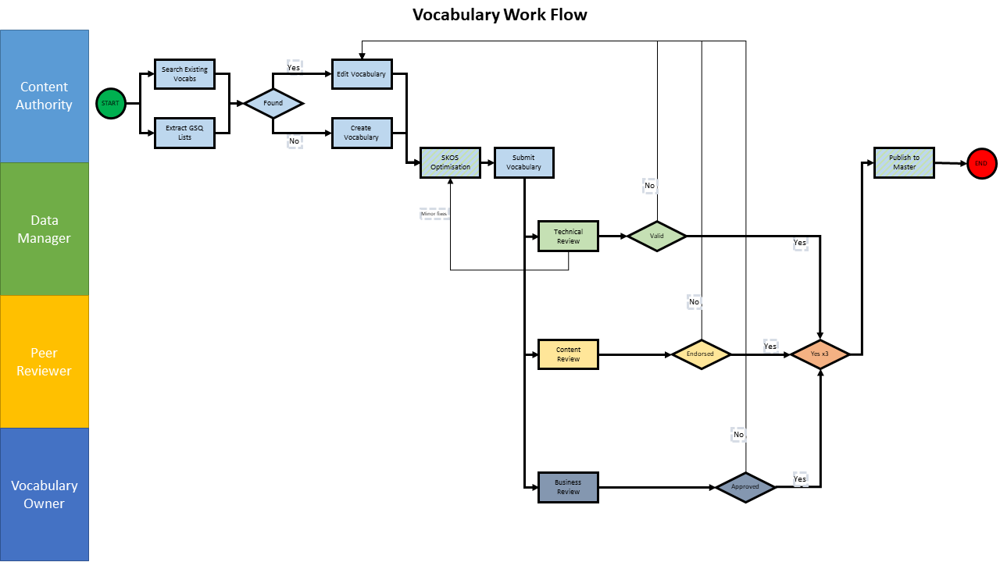

# GSQ Vocabularies
## Introduction
The Geological Survey of Queensland (GSQ) publishes vocabularies - a way to describe things and the relationship between things.

A vocabulary is a set of agreed terms:
* In GSQ, a vocabulary defines the terms used to describe and represent things in the domain of science and data management.
* Vocabularies align information within a business area or across systems.
* Vocabularies can be very complex (with thousands of terms) or very simple (describing one or two concepts only).

Read [Why Vocabularies?](https://github.com/geological-survey-of-queensland/vocabularies/wiki/Why-Vocabularies%3F) and more subjects in the [Vocabularies Wiki](https://github.com/geological-survey-of-queensland/vocabularies/wiki).

## Vocabulary - how it all hangs together
  

**Fig. 1: Vocabulary context diagram**

1. We use tools such as Vocbench or Excel to create the vocabulary using [SKOS Simple Knowledge Organization System](https://www.w3.org/TR/skos-reference). See also the [SKOS Primer](https://www.w3.org/TR/skos-primer) for the basics.
2. The native format for a vocabulary is a TTL (turtle) file. This file contains [RDF](https://en.wikipedia.org/wiki/Resource_Description_Framework) triples - subject > predicate > object statements.
3. We use Github (where you are now) to store and manage versions of vocabulary TTL files. Github also provides workflow functionality to approve vocabularies. Read the [Github getting started guide](https://guides.github.com/activities/hello-world/)
4. We import the TTL files into GraphDB to create a triple store. GraphDB lets us query the triples.
5. VocPrez presents our vocabs on the web for people and computers to read. VocPrez pulls the triples from GraphDB to create a cache of the vocabularies.
6. CKAN drop-down form fields pull their values from VocPrez. This ensures that the attributes uses to describe a dataset comes from the controlled vocabulary. 

## How to create a vocabulary
  

**Fig. 2: Vocabulary build and pull process**

1. **Search for existing** International, National, and Industry Standards. Use directly where possible, augment and adapt when needed, create new original vocabulary as a final option (see below for links to existing vocabularies).
2. **Create the vocabulary** using the [SKOS Simple Knowledge Organization System](https://www.w3.org/TR/skos-reference/)
    - See also the [SKOS Primer](https://www.w3.org/TR/skos-primer/) for the basics
    - Use one of these tools:
        1. [Vocbench](www.vocbench.gsq.digital:7200/) to create the vocabulary.  
        2. Excel templates - [GSQ's Excel SKOS Vocabulary Builder](https://github.com/geological-survey-of-queensland/vocabularies/blob/master/templates/SKOS_Vocabulary_Builder.xlsm).  
        3. Text Editor, e.g. Visual Studio Code
            - for VS Code, use the extension [Language Support for RDF related language syntax](https://marketplace.visualstudio.com/items?itemName=fantasticfears.semantic-data-model-language) for formatting support.  
3. **Allocate a URI** to the vocab
    - we use `linked.data.gov.au` for all GSQ vocabs
    - Arrange for URI allocation via the [Contacts](#contacts) below
3. **Export the vocabulary** to a TTL file
    - If using Vocbench, it is easier to export the TTL from the Build repository in GraphDB. Follow the [instructions here](http://graphdb.ontotext.com/documentation/standard/exporting-data.html).
4. **Validate the TTL file**
    1. Use the [online Skosify tool](http://demo.seco.tkk.fi/skosify/skosify). 
        - This tests for SKOS conformance
        - Tick the checkbox *Keep skos:related relationships within the same hierarchy*, leave the other checkboxes unticked.
    2. The use the GSQ Vocab [SHACL](https://www.w3.org/TR/shacl/) Shapes files
        - This tests for GSQ requirements over and beyond SKOS, such as particular metadata for the vocab
        - The files are stored in this repo, [shapes](shapes/)
        - Use the [pySHACL](https://github.com/RDFLib/pySHACL) tool on your desktop to do the validation
5. **Import the TTL file** into a development branch in Github. Name your branch *dev-vocabularyName*. See [how-to instructions here](https://guides.github.com/activities/hello-world/). 
6. **Submit a pull request** to the vocabularies repository.
  - Create a branch for your vocab named `review-vocabularyName`
  - add your vocab to that branch
  - create a Pull Request from that `review-` branch to `master` branch and nominate reviewers
    - See [how-to instructions here](https://help.github.com/en/articles/approving-a-pull-request-with-required-reviews)
  - Once 2+ reviews have passed (usually a data managmenet staff member and a science domain expert), the final reviewer will merge the `review-` branch into `master` branch and delete the `review-` branch
7. **Publication of the vocab** to production VocPrez will be automated from here onwards
  - You should see the vocab in https://vocabs.gsq.digital/vocabulary/ within hours of approval and merger
  - If testing of the vocab in VocPrez is required, the test instance will be used: https://test.vocabs.gsq.digital/vocabulary/
  - During UAT the vocabularies rendered in the test systems will be derived from files presented in https://vocabs.uat.gsq.digital/vocabulary

### Creation Workflow
The steps outlined above are shown in workflow form at the [Vocabulary Review Workflow wiki page](https://github.com/geological-survey-of-queensland/vocabularies/wiki/Vocabulary-Review-Workflow)

## See also
* Geoscience Australia http://ldweb.ga.gov.au/def/voc/ga/
* CGI Vocabularies Register http://resource.geosciml.org/def/voc/
* EarthResourceML Vocabularies http://resource.geosciml.org/def/voc/ (scroll down)
* Research Vocabularies Australia https://vocabs.ands.org.au/
* CSIRO Environment Registry http://registry2.it.csiro.au/
* Linked Open Vocabularies https://lov.linkeddata.es/dataset/lov
* ISO 19115 https://geo-ide.noaa.gov/wiki/index.php?title=ISO_19115_and_19115-2_CodeList_Dictionaries
* Basel Register https://bartoc.org/
* British Geological Survey https://www.bgs.ac.uk/data/vocabularies/home.cfm
* INSPIRE Code Lists http://inspire.ec.europa.eu/codelist
* NERC Vocabulary Server http://vocab.nerc.ac.uk/collection/
* Best practice in formalizing a SKOS vocabulary https://confluence.csiro.au/public/VOCAB/vocabulary-services/publishing-vocabularies/best-practice-in-formalizing-a-skos-vocabulary

## Repository Contents
* [vocabularies/](vocabularies/) - all GSQ's vocabularies, in RDF (Turtle) text files
* [shapes/](shapes/) - SHACL graph shape files used to validate vocab files before publication
* [scripts/](scripts/) - Python scripts to dump/load a GraphDB instance with these vocab files
* [templates/](templates/) - Excel and other tools to help with vocab creation

## License
This code repository's content are licensed under the [Creative Commons Attribution 4.0 International (CC BY 4.0)](https://creativecommons.org/licenses/by/4.0/), the deed of which is stored in this repository here: [LICENSE](LICENSE).

## Contacts
*Vocabularies owner*:  
**Mark Gordon**  
Geological Survey of Quensland  
Department of Natural Resources, Mines and Energy  
Brisbane, QLD, Australia  
<mark.gordon@dnrme.qld.gov.au>  

*Technical contact*:  
**Vance Kelly**  
Geological Survey of Quensland  
Department of Natural Resources, Mines and Energy  
Brisbane, QLD, Australia    
<vance.kelly@dnrme.qld.gov.au>  

*Author*:  
**David Crosswell**  
Enterprise Architect  
Cross-Lateral Enterprises   
<https://crosslateral.com.au>
